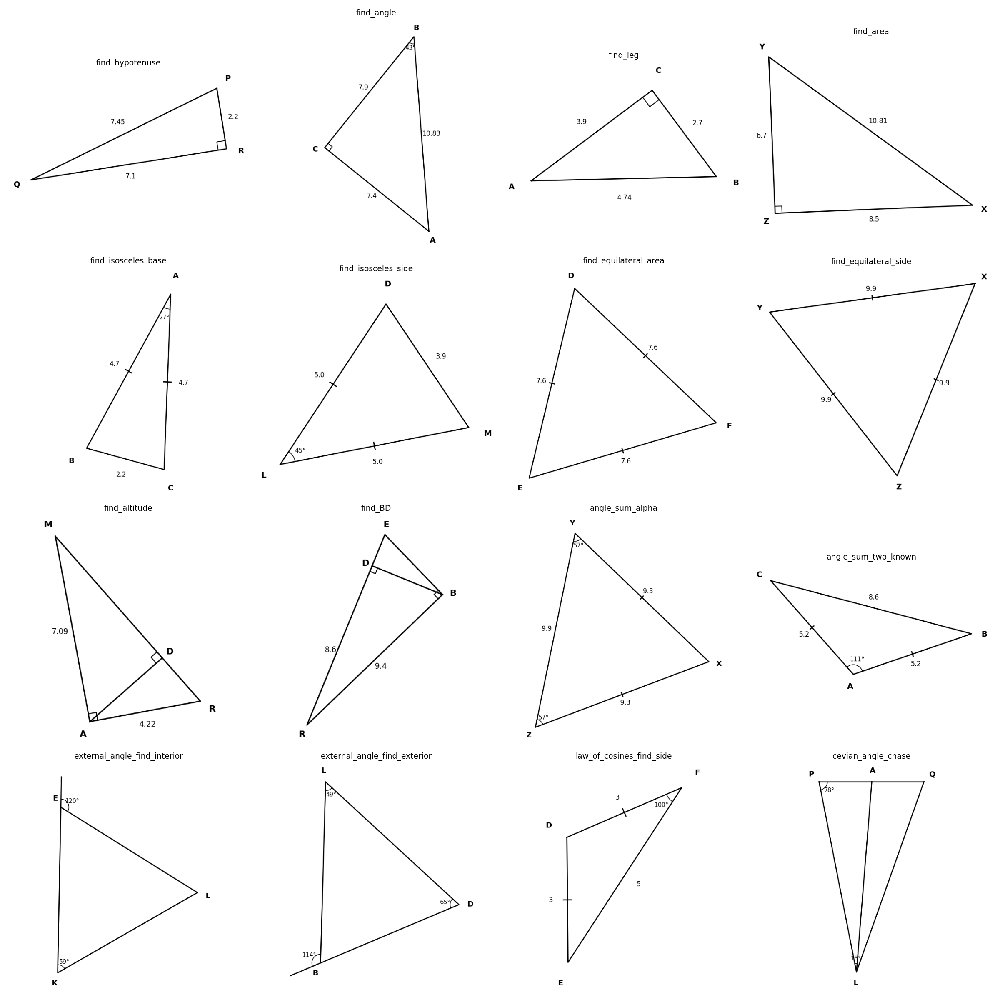

# geoparse

**Synthetic Geometry Diagram Generator + Solver**

A toolkit for generating synthetic geometry problems and training neural networks to parse and solve them.

## What This Is

This project explores **Sim2Real transfer** for geometry problem solving:

1. **Generate** thousands of synthetic geometry diagrams with ground truth
2. **Train** neural networks to parse diagram structure (vertices, angles)
3. **Solve** geometry problems using analytic calculations

### Key Finding

Training on synthetic data alone achieves **excellent performance on synthetic test sets** (Val Loss < 0.001), but **domain gap remains significant** for real textbook images. Real-world deployment would require fine-tuning on annotated real data or using VLM-based parsing.

## Features

### 📐 Synthetic Generator
- **Problem Types**: Right triangles, isosceles, equilateral, angle-sum, external angles, law of cosines, altitude problems
- **Domain Randomization**: Vertex labels (A-Z), fonts, colors, "sketchy" hand-drawn styles
- **Structured Output**: Full ground truth (coordinates, angles, side lengths)

### Example Diagrams

<p align="center">
  
</p>

*16 problem types generated by the synthetic generator, including right triangles, angle-sum, external angles, law of cosines, and nested triangles.*

### 🔬 Vision Models
- **Regression Parser**: ResNet18 → 8-dim coordinate output
- **Keypoint Detector**: Heatmap-based vertex detection (more robust architecture)

### 🧮 Solvers  
- **Analytic Solver**: Exact geometric calculations from coordinates
- **Neural Property Regressor**: Predicts all angles/sides from coordinates
- **Geometric Refinement**: Constraint optimization for precision

## Quick Start

```bash
# Clone and setup
git clone https://github.com/yourusername/geoparse.git
cd geoparse
python -m venv venv && source venv/bin/activate
pip install -r requirements.txt

# Generate sample diagrams
python generate_grid.py

# Train the parser (requires generated dataset)
python generate_dataset.py  # ~38k images, takes ~10 min
python run_train_v4.py      # Train regression parser
```

## Project Structure

```
geoparse/
├── generator/            # Synthetic diagram generation
│   ├── primitives.py     # Point, Segment, Triangle classes
│   ├── renderer.py       # Matplotlib-based diagram rendering
│   ├── sketchy_renderer.py  # Domain-randomized "hand-drawn" style
│   └── problems.py       # Problem type generators
├── parser/               # Vision models
│   ├── model.py          # DiagramParser (ResNet-based)
│   ├── keypoint_model.py # KeypointDetector (Heatmap-based)
│   ├── dataset.py        # DataLoader for training
│   └── train.py          # Training loop
├── solver/               # Geometric reasoning
│   ├── model.py          # NeuralSolver (property regressor)
│   └── refinement.py     # Constraint-based coordinate refinement
├── pipeline/             # End-to-end integration
│   └── solve.py          # GeometrySolver class
├── generate_dataset.py   # Large-scale dataset generation
└── roadmap.md            # Project planning document
```

## Results

| Model | Synthetic Val Loss | Real Textbook |
|-------|-------------------|---------------|
| Regression Parser | 0.0006 | ❌ Domain gap |
| Keypoint Detector | 0.0005 | ❌ Domain gap |
| Analytic Solver (given coords) | ✅ Exact | ✅ Exact |

**Lesson Learned**: The vision parsing (Synthetic → Real) is the bottleneck. The geometric reasoning (coordinates → answer) works perfectly.

## Extending

### Add New Problem Types
Edit `generator/problems.py`:
```python
def generate_my_problem():
    triangle = MyTriangleType(...)
    return Problem(triangle, goal="find X", answer=computed_value)
```

### Train on Real Data
1. Collect ~100 real textbook screenshots
2. Annotate vertex coordinates (use `labelme` or similar)
3. Add to dataset and fine-tune

## Lessons Learned

1. **Sim2Real is hard** — visual domain gap persists despite domain randomization
2. **Architecture matters less than data** — keypoint detection didn't magically solve generalization
3. **Analytic reasoning is easy** — once you have coordinates, math is deterministic
4. **VLMs are the pragmatic choice** — GPT-4o/Claude can parse diagrams out-of-the-box

## Future Directions

- [ ] VLM-based parsing (use GPT-4o vision API)
- [ ] Real data fine-tuning
- [ ] OCR integration for reading angle values
- [ ] Symbolic solver with step-by-step proofs

## License

MIT

## Acknowledgments

Built as an exploration of geometry problem solving and Sim2Real transfer learning.
